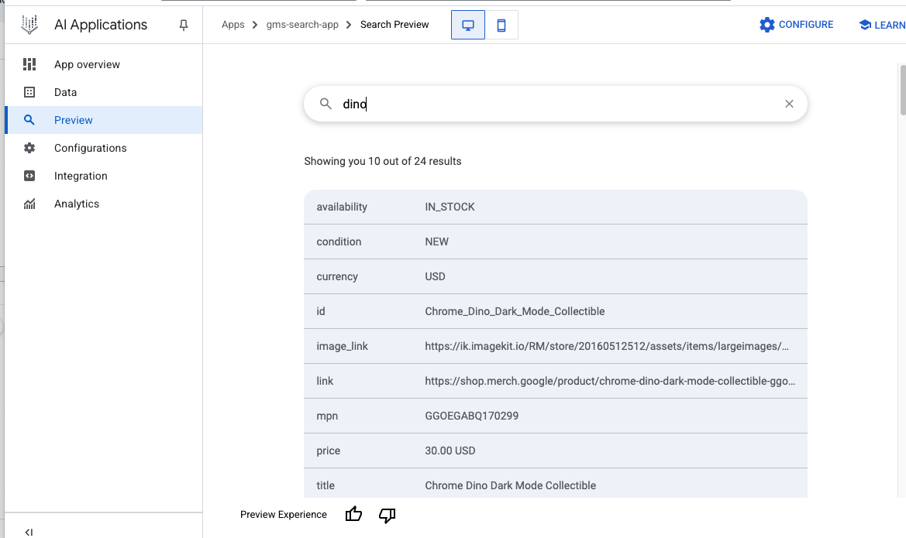
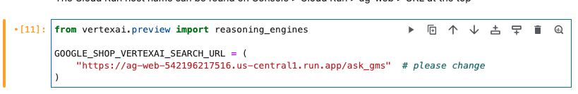

# GCP-LAB-Integrate-an-AI-Agent-with-a-Flutter-App-Using-AI-Applications
Integrate an AI Agent with a Flutter App Using AI Applications


##### Overview

In this lab, you integrate an AI agent with a Flutter app. Flutter is used as the client app framework, Vertex AI Search is used as a vector DB, and Reasoning Engine is used to build and deploy an agent with LangChain on Vertex AI. The agent uses Gemini, a family of highly capable large language models (LLMs) to generate AI responses to text and image prompts.

The lab is pre-provisioned with VSCode as the IDE using code-server, along with the Flutter and Dart extensions that are required to run the Flutter app. The lab also includes fwr, a tool that you use to serve the Flutter app as a web application which you access using a browser.

This lab is intended for developers of any experience level who contribute to building apps but might not be familiar with cloud application development. It helps to have some experience in Python, and to be familiar with the Flutter framework. It is not required to know Flutter to perform the tasks in this lab, though you will review some of the Flutter app code, and test the app's functionality.

###### Objectives

In this lab, you perform the following tasks:

. Create a search data store and search app using AI Applications in the Google Cloud console.

. Deploy a Reasoning Engine agent using Vertex AI Workbench.

. Use a Python app that integrates with Vertex AI Search and Reasoning Engine agent.

. Deploy the app to Cloud Run and use it as the backend for a Flutter app.

. Set up a Firebase project and connect it to the Flutter app.
 

Here is an overview of the different components used in this lab:


### Task 1. Create a search data store and search app

In this task, you implement search capability for your Flutter app by creating a search data store and search app using AI applications in the Google Cloud console.

###### Create a search data store

1. In the Cloud console, click View All Products. In the All Products page, scroll to the section on Artificial Intelligence, and then click AI Applications.


2. Click Continue and activate the API.

3. In the left pane, click Data Stores, and on the Data Stores page, click Create Data Store.

On this page, you configure your data source to be used for search results. The lab is pre-provisioned with a Cloud Storage bucket that contains a .csv file which has data about items from the Google merchandise shop.

4. To select Cloud Storage as the source of data, under Cloud Storage, click Select.

5. For the kind of data being imported, select Structured FAQ data for a chat application (CSV).

6. To select a folder or file to import, click File.

7. To provide the Cloud Storage URL to the CSV file, click Browse.


8. To view the contents of the Cloud Storage bucket To be replaced at lab start, click Button to view contents of Cloud Storage bucket.

9. Select the goog_merch.csv file, and then click Select.

The gs:// URI to the folder is populated.


10. Click Continue.

11. For the data store name, type goog-merch-ds.

12. Click Create.

A data store is created, and data ingestion from the CSV file is initiated.

13. On the Data Stores page, click the name of your newly created data store.

14. The Documents tab displays a list of documents that were imported. To view the data associated with a document, click View Document.


##### Create a search app

To use the search data store, you connect it to a search app in Vertex AI Agent Builder.

1. In the Cloud console, click AI applications, then click Apps.

2. Click Create App.

3. On the Create App page, under Search for your website, click Create.


4. On the Search app configuration page, configure a website search app with these settings, leaving the remaining settings as their defaults:

| Property | Value (type or select) |
| Enterprise edition features |	Disable |
| Your app name	| gms-search-app |
| External name of your company or organization | gms-company |
| Location of your app | global (Global) |

5. Click Continue.

6. A list of existing data stores is displayed. Select the goog_merch_ds data store that you created in the previous subtask.

7. To create the search app, click Create.

The search app is created and the data store is connected to the app.


8. To test the search app, in the AI applications navigation menu, click Preview.


9. In the Search field, type dino.

A list of related search results are displayed from the documents that were imported into the data store.


>Note: If you see an error indicating that Search preview isn't ready yet, please wait a few minutes before retrying. If you do not want to wait, you can continue with the next task in the lab.




### Task 2. Build and deploy the backend

The backend of our Flutter app will run as a Cloud Run service on Google Cloud. The backend service integrates with the search app that you created in the previous step to generate search responses from the merchandise shop data. The backend also integrates with a Reasoning Engine agent to access Gemini for generative AI content in response to queries from the Flutter app.

In this task, you build and deploy the backend Python app to Cloud Run.

##### Configure and review the backend app

1. An IDE based on VSCode is pre-provisioned for this lab. To access the IDE, copy the IDE Service URL from the lab's Qwiklabs credentials panel and paste it into a new incognito browser window.

>Note: The IDE service URL is the endpoint of a Cloud Run service that is pre-provisioned for this lab, and proxies requests to the code-server VM. The IDE is built using Code Server and includes the Flutter, Dart, and Vim extensions.


2. Open a terminal in the IDE. In the IDE navigation menu (VS Code main menu), click Terminal > New Terminal.

>Note: Run the commands in the steps below in the IDE terminal window.

3. The initial version of the backend app and related files are pre-provisioned for the lab. Copy the initial version of the backend app folder and its contents from Cloud Storage:


```
gcloud storage cp -r gs://cloud-training/OCBL453/photo-discovery/ag-web ~
```

>Note: If prompted, click Allow to paste text and images from the clipboard, and press Enter.


4. To list the contents of the folder, in the IDE terminal window, run:

```
ls ~/ag-web/app
```
The ag-web/app folder contains the application source code and other files needed to build and deploy the backend app to Cloud Run.

5. Set the PROJECT_ID, LOCATION, and STAGING_BUCKET configuration for the app.

```
sed -i 's/GCP_PROJECT_ID/qwiklabs-gcp-04-f9624967eddc/' ~/ag-web/app/app.py
sed -i 's/GCP_REGION/us-central1/' ~/ag-web/app/app.py
sed -i 's/GCS_BUCKET/qwiklabs-gcp-04-f9624967eddc-lab-bucket/' ~/ag-web/app/app.py
```


6. Configure the backend app to use the search data store that you created earlier.

In the command below, replace the string {YOUR_SEARCH_DATA_STORE_ID} with the value of your search data store ID.

Make sure to remove the curly braces in the sed command.


>Note: To get the value of the search data store ID, in the Cloud console, navigate to AI Applications > Data Stores, and then click on the name of your search data store that you created earlier. Copy the value of the Data store ID, which is same as the search engine ID.

```
sed -i 's/SEARCH_ENGINE_ID/goog-merch-ds_1747080039185/' ~/ag-web/app/app.py
```


7. To view the code in the IDE, in the IDE navigation menu, click Explorer, and then click Open Folder.

8. Select the IDE-DEV/ag-web/ folder from the list, and then click Ok.

9. To trust the authors of the code, click Yes, I trust the authors.

10. In the Explorer pane, expand the app folder, and then click app.py to open the file in the editor.

The backend app code does the following:

- Initializes Vertex AI using your lab Google Cloud project ID, region, and Cloud Storage bucket.

- The search_gms() function uses the discoveryengine.googleapis.com API datastores endpoint to initiate a search request. The datastore ID that you created earlier is used in the URL.

- The function uses the user supplied search query to perform the search on the contents of the datastore, and formats the results into a JSON response.

- The app uses flask to route calls to the individual functions. The / endpoint is the default page that is used to verify that the app loads successfully, while the /ask_gms endpoint invokes the search_gms() function that uses Vertex AI Search.


###### Build and deploy the app to Cloud Run
A deploy script is available to build and deploy the backend app to Cloud Run.

1. Open a terminal window in the IDE, and change to the backend app folder:

```
cd ~/ag-web/app
```

2. Authenticate to Google Cloud from the gcloud CLI:

```
gcloud auth login
```


3. To continue, type Y

4. To launch the sign-in flow, press Control (for Windows and Linux) or Command (for MacOS) and click the link in the terminal.

5. If you are asked to confirm the opening of the external website, click Open.

6. Click the lab student email address.

7. When you're prompted to continue, click Continue.

8. To let the Google Cloud SDK access your Google Account and agree to the terms, click Allow.

Your verification code is displayed in the browser tab.

9. Click Copy.

10. Back in the IDE terminal window, where it says Enter authorization code, paste the code and type Enter.

You're now signed in to Google Cloud.

11. Make the deploy.sh script executable, and then run the script to deploy the app in the specified Cloud Run region:

```
chmod a+x deploy.sh; ./deploy.sh qwiklabs-gcp-04-f9624967eddc us-central1
```

After the app is built and deployed to Cloud Run successfully, the app's endpoint URL is displayed at the script output end. The URL was generated by the gcloud run deploy command that was executed in the script.


>Note: This command takes time to execute so wait until it completes before proceeding to the next task.

##### Test the backend app

You test the app functionality by accessing it's Cloud Run endpoint.

1. Copy the app's endpoint URL that was generated in the previous step, and navigate to that URL in a new browser tab.

2. When the app loads, the home page displays Welcome to the ag-web backend app.


3. In the browser URL bar, append the path below to the end of the URL:

```
/ask_gms?query=dino
```

4. Verify that the app responds with results from the search data store that you created earlier.


### Task 3. Configure Firebase

To invoke the Gemini API, the front end Flutter app uses the Vertex AI for Firebase Dart SDK. This SDK is available as the firebase_vertexai package from pub.dev which is the official package repository for Dart and Flutter apps.

Firebase is a backend app development platform from Google that provides services for various platforms that include Android, iOS, and others.

In this task, you set up Firebase, and sign in to the Firebase CLI. Later in the lab you'll connect your Flutter app to Firebase.

###### Set up Firebase

To use the SDK, you first set up a Firebase project.

1. In an incognito window tab, access the Firebase console at https://console.firebase.google.com.

2. Click Create a project.


3. To add Firebase to your lab's existing Google Cloud project, at the bottom of the page, click Add Firebase to Google Cloud project.

4. Click Select a Google Cloud project, and then select the lab project from the list.


5. Accept the terms, and then click Continue.

6. To use the default billing plan, click Confirm plan.

7. Click Continue.

8. Disable Google Analytics for this project, and then click Add Firebase.

9. Wait until your Firebase project is ready, and then click Continue.

Firebase is now ready to use with your lab Google Cloud project.


###### Sign in to Firebase
1. In your IDE terminal window, sign in to the Firebase CLI:

`firebase login --no-localhost`


2. To allow Firebase to collect CLI and Emulator reporting information, type Y, and press Enter.

3. Note your session ID, and then follow the steps to launch the sign-in flow. Press Control (for Windows and Linux) or Command (for MacOS) and click the URL in the terminal.

4. When prompted to open the external website, click Open.

5. Click your lab student email ID.

6. Click Continue.

7. To grant relevant permissions to the Firebase CLI, click Allow.

8. Click Yes, I just ran this command.

9. Verify your session ID, and then click Yes, this is my session ID.

10. To copy the authorization code, click Copy.

11. Paste the authorization code where requested in the IDE terminal window, and press Enter.

You are now signed in to the Firebase CLI.


### Task 4. Create a Reasoning Engine AI agent

An AI Agent is an application that uses the power of large language models (LLMs) for reasoning and orchestration with external tools to achieve its goal. Vertex AI Agent Builder is a suite of products and tools from Google that helps you build AI agents by connecting them to your trusted data sources.

Vertex AI Reasoning Engine (also known as LangChain on Vertex AI) helps you build and deploy a reasoning agent with Vertex AI Agent Builder. LangChain is a popular OSS tool used to build chatbots and RAG systems.

Reasoning Engine lets developers use Function Calling, to map the output from LLMs (Gemini) to Python functions. Reasoning Engine integrates closely with the Python SDK for the Gemini model in Vertex AI, and is compatible with LangChain and other Python frameworks.

In this task, you use Vertex AI Workbench with a Jupyter notebook to deploy a Reasoning Engine agent with Python functions. The agent will be used in our generative AI backend application in the next task in this lab.

###### Create a Vertex AI Workbench instance

Vertex AI Workbench is a Jupyter notebook-based development environment for the entire data science and machine learning workflow. You can interact with Vertex AI and other Google Cloud services from within a Vertex AI Workbench instance's Jupyter notebook. For example, Vertex AI Workbench lets you access and explore your data from within a Jupyter notebook by using BigQuery and Cloud Storage integrations.

Vertex AI Workbench instances come with a preinstalled suite of deep learning packages, including support for the TensorFlow and PyTorch frameworks.

Vertex AI Workbench notebooks provide a flexible and scalable solution for developing and deploying ML models on Google Cloud.

1. To create a Workbench instance, in the Cloud console, click the Navigation menu (Navigation menu icon), and then select Vertex AI > Workbench.

2. If prompted in the Cloud console, click to enable the Notebooks API.

3. Make sure that Instances is selected in the Instances tab, and then click Create New.

 

4. In the New instance page, for Name, type my-instance

5. Leave the remaining settings as their defaults, and then click Create.

Your new instance spins up in the instances section. Wait for the instance to be created before proceeding to the next step.

>Note: A green check appears next to the instance when it is ready to use.

6. Once the instance is ready, click Open Jupyterlab.

 

7. To launch a Python 3 Jupyter Notebook, click the Python 3 notebook.


##### Copy a notebook file

A notebook that builds and deploys a Reasoning Engine agent has been pre-provisioned for this lab.

1. To copy the notebook to your JupyterLab instance, copy this code into the first cell in your new notebook:

`!gcloud storage cp gs://cloud-training/OCBL453/photo-discovery/ag-web/ag_setup_re.ipynb .`


2. Select the cell and run it by clicking Run in the cell menu:


The command copies the notebook from Cloud Storage to your JupyterLab instance. After the command completes, the notebook file is listed under the top-level root folder.


3. To open the notebook, double-click the notebook file in the folder listing. A separate tab is created with the content of the notebook.

###### Build and deploy a Reasoning Engine agent

1. Run all the code cells in the notebook in order from the beginning. To run a cell, select it by clicking anywhere in the cell, and then click Run in the cell menu or in the top notebook menu.

>Note: When running the command in a cell, wait for the command to complete before moving on to the next cell. When a command completes execution, the asterisk (*) in the cell number field is replaced by the number of the cell.

>Note: Before running a cell, please check the notes below for any cell-specific instructions or steps to follow. These instructions are marked with the CELL INSTR prefix.

a. [CELL INSTR] Restart current runtime

If prompted, in the Kernel Restarting dialog, click Ok.

b. [CELL INSTR] Set Google Cloud project information and initialize Vertex AI SDK:

Before running this cell to initialize the Vertex AI SDK, update the configuration values for your lab project_id, location, and staging bucket:

```
PROJECT_ID = "qwiklabs-gcp-04-f9624967eddc"
LOCATION = "us-central1"
STAGING_BUCKET = "gs://qwiklabs-gcp-04-f9624967eddc-lab-bucket"
```


Updated cell with sample configuration settings:


c. [CELL INSTR] Define Tool function for Vertex AI Search:

Before running this cell, replace the value of the GOOGLE_SHOP_VERTEXAI_SEARCH_URL with the Cloud Run endpoint URL of your backend app.

To fetch the endpoint URL, in the Cloud console, navigate to Cloud Run, and then click the name of the backend app: ag-web. Copy the value of the endpoint URL and replace it in the cell.


Updated cell with sample Cloud Run endpoint URL of the backend app:


>Note: You can also run a cell by clicking Run in the notebook menubar.

2. After running the cell Deploy the Agent to the Reasoning Engine runtime, wait for the command to complete and create the Reasoning Engine agent. Then, copy the Reasoning Engine ID:



You will use this ID to configure and re-deploy the backend app in the next task.

>Note: This cell can take up to 10 minutes to complete. Wait for the final output to be displayed indicating that the ReasoningEngine is created before continuing to the next step.


3. To test the successful operation of the Reasoning Engine agent, run the next two cells and observe the output.

The Reasoning Engine agent has successfully invoked either the Wikipedia or the Vertex AI Search datastore based on the query input and the output from the Gemini model.


### Task 5. Enhance the backend app
Let's now enhance the backend app to invoke the Reasoning Engine agent that you deployed in the previous task.

The initial version of the backed app only fetched results directly from Vertex AI Search. In the new version, the app will invoke the Reasoning Engine agent that uses output from Gemini and the agent's tools to generate a response from Vertex AI Search or Wikipedia based on the input prompt.

In this task, you update the backend app code to add an additional entry point that invokes the Reasoning Engine agent with a request query and return the agent's response.

###### Update the backend app

1. In the IDE terminal window, append the app.py file with the new entry point code by running the command:

```
cat << EOF >> ~/ag-web/app/app.py
#
# Reasoning Engine
#
NB_R_ENGINE_ID = "REASONING_ENGINE_ID"

from vertexai.preview import reasoning_engines
remote_agent = reasoning_engines.ReasoningEngine(
    f"projects/{PROJECT_ID}/locations/{LOCATION}/reasoningEngines/{NB_R_ENGINE_ID}"
)

# Endpoint for the Flask app to call the Agent
@app.route("/ask_gemini", methods=["GET"])
def ask_gemini():
    query = request.args.get("query")
    log.info("[ask_gemini] query: " + query)
    retries = 0
    resp = None
    while retries < MAX_RETRIES:
        try:
            retries += 1
            resp = remote_agent.query(input=query)
            if (resp == None) or (len(resp["output"].strip()) == 0):
                raise ValueError("Empty response.")
            break
        except Exception as e:
            log.error("[ask_gemini] error: " + str(e))
    if (resp == None) or (len(resp["output"].strip()) == 0):
        raise ValueError("Too many retries.")
        return "No response received from Reasoning Engine."
    else:
        return resp["output"]
EOF
```

2. Configure the backend app to use the Reasoning Engine agent that you created earlier.

Replace the string {YOUR_REASONING_ENGINE_ID} in the command below with the value of your Reasoning Engine ID that you copied from the notebook cell in the previous task, and run the command below in the IDE terminal window.

Make sure to remove the curly braces in the sed command.

```
sed -i 's/REASONING_ENGINE_ID/goog-merch-ds_1747080039185/' ~/ag-web/app/app.py
```

3. To view the code in the IDE, in the IDE navigation menu, click Explorer, and select the IDE-DEV/ag-web/app/app.py file.

In the enhanced version of the backend app:

. A handle on the remote_agent is retrieved from the Reasoning Engine runtime using the REASONING_ENGINE_ID of the agent that you created in the previous task.

. A new /ask_gemini endpoint that defines the `ask_gemini() function is defined.

. The function passes the user supplied query parameter from the request to the Reasoning Engine (remote_agent), and returns the response from the agent.

###### Build and re-deploy the backend app to Cloud Run

1. Change to the backend app folder:

`cd ~/ag-web/app`

2. Run the script to re-deploy the app in the specified Cloud Run region:

```
./deploy.sh qwiklabs-gcp-04-f9624967eddc us-central1

```

###### Test the backend app
You test the app functionality by accessing it's Cloud Run endpoint.

1. Copy the app's endpoint URL that was generated in the previous step, and navigate to that URL in a new browser tab.

2. When the app loads, the home page displays Welcome to the ag-web backend app.

3. In the browser URL bar, append the path below to the end of the URL:

`/ask_gemini?query=where can I buy the dino pin`

The app responds with results from the agent that fetched results from the Vertex AI search data store that you created earlier.

<div style="background-color: #ffeb3b; padding: 8px; border-radius: 4px;">
Chrome Dino Enamel Pin is a product sold at Google Merch Shop. The price is 7.00 USD. You can buy the product at their web site: https://shop.merch.google/product/chrome-dino-enamel-pin-ggoegcbb203299/.
</div>

4. In the browser URL bar, replace the path with:

`/ask_gemini?query=what is fallingwater`


The app responds with results from the agent that fetched a response from the Wikipedia API that you configured in the notebook.

<div style="background-color: #ffeb3b; padding: 8px; border-radius: 4px;">
Fallingwater was designed by architect Frank Lloyd Wright in 1935. It is located in southwest Pennsylvania, about 70 miles southeast of Pittsburgh. The house is famous because it was built partly over a waterfall.
</div>


### Task 6. Test drive Gemini 2.0 Flash

Now that you've developed and deployed your backend app, Vertex AI Search components, and a Reasoning Engine agent, you can now begin to design and build the Flutter front end.

The Flutter app enables users to discover more information about photos which they upload in the app. The app integrates with Gemini to generate responses about the photos, and uses an AI agent to provide responses using a chat interface.

Before you develop the front end app, you need to define the structure of the responses that are returned from the Gemini 2.0 Flash model. This model is used by the AI agent that you deployed earlier in the lab.

In this task, you prompt the Gemini 2.0 Flash model, and view the model response in JSON format.

1. Gemini 2.0 Flash is available in Vertex AI Studio in the Cloud console. To access Vertex AI Studio, click the navigation menu (Navigation menu icon) and then select Vertex AI > Create prompt (under Vertex AI Studio).

2. To enable the APIs that are required to use Vertex AI Studio, click Agree and Continue.

>Note: Vertex AI Studio is a tool in the Google Cloud console that lets you quickly test and prototype generative AI models so you can leverage their capabilities in your applications.

3. For the Prompt, click Insert Media, and then select Import from Cloud Storage.


4. Click > next to the name of the lab bucket set at lab start.


5. Select the image file fallingwater.jpg, and then click Select.

The image is uploaded into the Prompt box.

6. To prompt the model, in the prompt box below the image, type What is this?, and then click Send (Send).

The model provides a brief response correctly describing the object in the image.

7. To fetch more information from the model in JSON format, modify the text prompt:

```
What is this? Provide the name and description of the object, and be as specific as possible. Also include a list of 3 follow-up questions that I can ask for more information about this object. Generate the response in JSON format with the keys "name", "description", and "suggestedQuestions".
```

8. Click Send (Send).

View the JSON response that is generated by the model.

<div style="background-color: #ffeb3b; padding: 8px; border-radius: 4px;">
{
"name": "Fallingwater",
"description": "This is Fallingwater, a house designed by renowned architect Frank Lloyd Wright. It's built over a waterfall on Bear Run in rural southwestern Pennsylvania, and is considered a masterpiece of organic architecture, seamlessly blending with its natural surroundings.",
"suggestedQuestions": [
"Who commissioned Frank Lloyd Wright to design Fallingwater?",
"What are some of the key architectural features of Fallingwater?",
"Is Fallingwater open to the public, and if so, how can I visit?"
]
}
</div>

You now have a prompt and model response in JSON format which we can use to build your flutter app.

>Note: The model response you receive might differ from the response displayed above.


### Task 7. Deploy the Flutter front end app
Now that you have the structure of the data that is returned by the model, you can build the front end app.

Flutter is an open-source multi-platform app development framework. It lets you write one codebase that runs on Android, iOS, Web, macOS, Windows, and Linux. Flutter apps are developed in the Dart programming language.

For the purposes of this lab, you will use web as the target platform, so that the Flutter app can be deployed as a web application and accessed using a browser.

In this task, you will review the Flutter app code, and build and run the app as a web application.


###### Review the Flutter app codebase

One of the app functions lets users upload a photo of a tourist attraction, and then queries Gemini to fetch information about the photo. For the purpose of this lab, the Flutter app has been developed and made available in Cloud Storage.

1. In your IDE terminal, download the Flutter app code:

`gcloud storage cp -r gs://cloud-training/OCBL453/photo-discovery/app ~`


2. To fetch the app project dependencies, in the IDE terminal window, run:

`cd ~/app; flutter pub get`

3. To view the code in the IDE, in its navigation menu (VS Code main menu), click File, and then select Open Folder.

4. Select the /home/ide-dev/app/ from the list, and then click Ok.

5. To trust the authors of the files in the folder, click Yes, I trust the authors.

Here is a high-level overview of the app folder contents:

| Folder/File	| Description |
| app |	Project root folder that contains the sub-folders and files that make up the Flutter app. |
| android/ios/linux/macos/web/windows |	Contains platform-specific files that are needed to run the Flutter app on each supported platform. |
| lib |	Contains the core application Dart files that includes the functionality, routing, data models, and user interface. |
| test	| Contains Dart tests that are used to test the app's widgets. |
| pubspec.yaml | Contains the app dependencies, Flutter version, and other configuration settings. |
| analysis_options.yaml	| Contains configuration settings for static analysis of the app. |

Let's review some of the files in these folders.

6. In the Explorer menu, click the /app/lib/models folder, then click the metadata.dart file to open it.

The metadata.dart file contains the data model that is used by the Flutter app.

<mark style="background-color: #ffeb3b; padding: 2px 5px;">
```
class Metadata {
   String name = '';
   String description = '';
   List<string> suggestedQuestions = [];
   // more code follows ...
 }
 </string>
```
</mark>

The metadata object attributes maps to the JSON attributes that are returned in the response from the Gemini API. The fromJson method initializes the object attributes when it is invoked.

7. In the Explorer menu, click the /app/lib/main.dart file to open it.

This is the application entry point for the Flutter app. After performing initialization tasks, the code in this file builds the app's UI using material components, sets the app's title, theme, and routing configuration.

>Note: A Material app starts with the MaterialApp widget, which builds a number of useful widgets at the root of your app, including a Navigator that manages routing to various screens in your app.

8. To view the app's routing configuration, in the Explorer menu, click the /app/lib/functionality/routing.dart file to open it.

The code in this file defines the /, /chat, and /settings routes for the app.

Flutter uses the concept of Widgets, which are declarative classes that are used to build the app. In Flutter, you create a layout by composing widgets to build more complex widgets to form a widget tree. To learn more about building UI's in Flutter, view the documentation.

9. Let's review the code that is responsible for some of the app's UI screens and functionality. In the Explorer menu, click the /app/lib/ui/screens/quick_id.dart file to open it.

This file contains the classes that build the app's widgets. It includes the class GenerateMetadataScreen that builds the app's main page and is invoked from the / path that is defined in the routing.dart file. The UI lets the user upload an image from their computer or mobile device, or take a photo from the device camera.

Flutter app main page

Other UI screens that are used in the app are for settings and the chat page which are implemented in the settings.dart and chat.dart files in the app/lib/ui/screens/ folder.

During app initialization, the Vertex AI for Firebase Dart SDK is used to fetch an instance of the Gemini genAI model that will be used by the app. This is implemented in the _GenerateMetadataScreenState class.

<mark style="background-color: #E6E6FA;">

```
void initState() {
super.initState();
model = FirebaseVertexAI.instance.generativeModel(
  model: geminiModel,
  generationConfig: GenerationConfig(
    temperature: 0,
    responseMimeType: 'application/json',
  ),
);
}
```
</mark>


After the user selects an image, the app invokes the Vertex AI Gemini API with the image and a text prompt. The text prompt used is the same as that you tested in an earlier task when test driving the Gemini 2.0 Flash model.

The _sendVertexMessage() method contains the code that sends the prompt. Here is partial code from the method:

<mark style="background-color: #E6E6FA;">

    ```
    Future<void> _sendVertexMessage() async {
    ...
    final messageContents = Content.multi(
        [
        TextPart(
            'What is the subject in this photo? Provide the name of the photo subject, and description as specific as possible, and 3 suggested questions that I can ask for more information about this object. Answer in JSON format with the keys "name", "description" and "suggestedQuestions".'),
        DataPart('image/jpeg', _image!),
        ],
    );

    var response = await model.generateContent([messageContents]);
    var text = response.text;
    if (text == null) {
        _showError('No response from API.');
        return;
    } else {
        var jsonMap = json.decode(text);
        if (mounted) {
        context.read<appstate>().updateMetadata(Metadata.fromJson(jsonMap));
        }
    }
    ...
    }
    </appstate>
    
    </void>

    ```
</mark>

The JSON response from the model is then decoded to extract the name, description, and suggestedQuestions, which are saved locally and displayed in the app UI.

###### Connect the Flutter app to Firebase

1. Change to the app root project folder, and activate the flutterfire_cli package:

`dart pub global activate flutterfire_cli`

2. To register your Flutter app with Firebase, run:

`flutterfire configure --project=set at lab start`

After executing the command, a firebase_options.dart configuration file is added to the lib folder of your Flutter project.

3. To configure the supported platforms for the app, press space to deselect all platforms except web. Scroll through the platforms using the arrow key. Then press Enter.

Your Flutter web app is now registered for use with Firebase.

###### Configure the Flutter app chat feature

The Flutter app has a chat feature that lets users find out more information about the image that they uploaded in the app, or request information from other external data sources that might have more updated information. To do this, we need a way to connect or ground the Gemini model to those data sources.

To implement this feature, the Flutter app integrates with the Reasoning Engine agent that you deployed earlier in this lab. Integration is achieved by connecting the Flutter app to the endpoint of the backend app that you also built and deployed to Cloud Run.

1. First, fetch your Cloud Run endpoint hostname of the backend app, and store the value in an environment variable. In the IDE terminal window, run:

```
BACKEND_APP_HOST=$(gcloud run services describe ag-web --region set at lab start --format 'value(status.url)' | cut -d'/' -f3);
echo $BACKEND_APP_HOST

```


2. For the Flutter app, the backend app endpoint is configured in the ~/app/lib/config.dart file. Update the configuration entry in the file:

`sed -i "s/cloudRunHost = .*/cloudRunHost = '$BACKEND_APP_HOST';/" ~/app/lib/config.dart`

3. To verify the change, in the IDE Explorer menu, click the IDE-DEV/app/lib/config.dart file to open it. Verify that the cloudRunHost config entry value is updated according to the sample below.

Backend app endpoint configuration

> Note: The value should match the value of the `BACKEND_APP_HOST` environment variable that you set in a previous step.


###### Review the chat feature code

Let's review the code in the Flutter app that implements the chat feature.

1. In the IDE Explorer menu, click the /app/lib/ui/screens/chat.dart file to open it.

The class ChatPage builds the Flutter widget for the chat page in the UI. This page is displayed in the UI when the Tell me more button is pressed.

Chat UI

To build the chat UI, the app uses the flutter_chat_ui_package that implements most of the chat boilerplate code which you can customize. The build() method uses the Chat class to construct the widget.


<mark style="background-color: #E6E6FA;">

```
Widget build(BuildContext context) {
...
  Chat(
        typingIndicatorOptions: TypingIndicatorOptions(
          typingUsers: typingUsers,
        ),
        listBottomWidget: suggestionsWidget,
        messages: _messages,
        onSendPressed: _handleSendPressed,
        showUserAvatars: true,
        showUserNames: true,
        user: _user,
        theme: DefaultChatTheme(
          receivedMessageBodyTextStyle: TextStyle(
            color: Theme.of(context).colorScheme.onSurface,
          ),
          sentMessageBodyTextStyle: TextStyle(
            color: Theme.of(context).colorScheme.onSecondary,
          ),
          userAvatarNameColors: [
            Theme.of(context).colorScheme.primary,
          ],
          backgroundColor:
              Theme.of(context).colorScheme.surfaceContainerHigh,
          primaryColor: Theme.of(context).colorScheme.primary,
          secondaryColor: Theme.of(context).colorScheme.surface,
        ),
      ),
...
}

```
</mark>

The listBottomWidget is used to display the list of suggested questions that are returned in the response from the previous Gemini call, enabling the user to select a question as the chat message.

The _handleSendPressed() callback method is invoked when the user clicks Send in the chat window. The method constructs a new message, adds the message to the message list, and sends the message to the backend using the askAgent() method.

2. Scroll the code to find the askAgent() method.

To invoke Gemini using the Reasoning Engine agent, the askAgent() method sends a request to the /ask_gemini URL at the Cloud Run endpoint of the backend app. The request query parameters include the image name and description that were returned in the previous call to Gemini, and the user's message.


```
 Future<string> askAgent(
     String name, String description, String question) async {
 var query = 'The photo is $name. $description. $question.';

 var endpoint = Uri.https(cloudRunHost, '/ask_gemini', {'query': query});
 var response = await http.get(endpoint);

 if (response.statusCode == 200) {
   var responseText = convert.utf8.decode(response.bodyBytes);

   return responseText.replaceAll(RegExp(r'\*'), '');
 }

 return 'Sorry I can\'t answer that.';
 }
 </string>

```

The response from the backend is then added to the list of messages in the chat window by the calling function _sendMessageToAgent().

###### Deploy the Flutter app

Now that the Flutter app configuration is complete, you can build and deploy the app. For the purpose of this lab, to run the app as a web application, we use Fwr which is a development server for Flutter web.

1. Make sure you are in the Flutter app folder. In the IDE terminal window, run:

`cd ~/app`

2. To fetch the app project dependencies, run:

`flutter pub get`

3. To build the project and start the web server, run:

`fwr`

Wait for the server to start and serve the Flutter app. Once started, the output from the command should be similar to:

fwr command output


### Task 8. Test the Flutter app
Let's test the Flutter app's functionality.

###### Download test images
1. To test the app, first download and save an image to your computer. Copy the URL to view the image in a separate browser tab:


2. Right-click the image and save it to your computer.

3. Repeat these steps to download an image of the Google Chrome Dino pin from the URL below:

Google Chrome Dino Pin Image

###### Test the app

1. To access the Flutter app, copy the Live Server URL from the Qwiklabs credentials panel, and paste it in a new browser tab.

2. Wait a few seconds for the app to load. Then, to upload the Fallingwater image, click Choose from Library.

After you upload the image, the app invokes the Vertex AI Gemini API to generate a response that contains the name, and description of the image which are displayed in the app's UI.

Flutter app test output

It might take a few seconds for the name and description fields in the app UI to populate from the Gemini model response.

>Note: If you receive a permission denied error, please ignore it, and click the ok button to proceed. Click Remove image, and then re-upload the image.

3. Click Tell me more.

The chat page loads and displays the Suggested Questions that were returned in the response from the previous call to the Gemini API.

Flutter app test chat

>Note: If suggested questions are not displayed, refresh the page, and then repeat the previous two steps to upload the image.

4. Click on one of the suggested questions and view the response from the chat agent.

The agent makes an HTTPS call to the Cloud Run endpoint of the backend app, which then invokes the Reasoning Engine agent that uses Gemini to return a response from Wikipedia.

###### Test the app with merchandise data

1. In the chat UI, click Remove image.

2. To upload the Google Chrome Dino pin image, click Choose from Library, and upload the image you saved earlier.

After you upload the image, the app invokes the Vertex AI Gemini API to generate a response that contains the name, and description of the image which are displayed in the app's UI.

3. Click Tell me more.

4. In the chat message box, type:

`Where can I buy this pin?`

The agent makes an HTTPS call to the Cloud Run endpoint of the backend app, which then invokes the Reasoning Engine agent that uses Gemini to return a response from the Vertex AI search data store.

Agent response about the Google Chrome Dino pin

5. (Optional) To see the Flutter app snap to a mobile layout, resize your browser window to roughly the size of a mobile device:

Flutter app resized to mobile size

This indicates that the Flutter app is responsive to changes based on the screen or window size. Flutter has widgets and packages that help make your app responsive and adaptive to changes based on device configuration.


##### End your lab